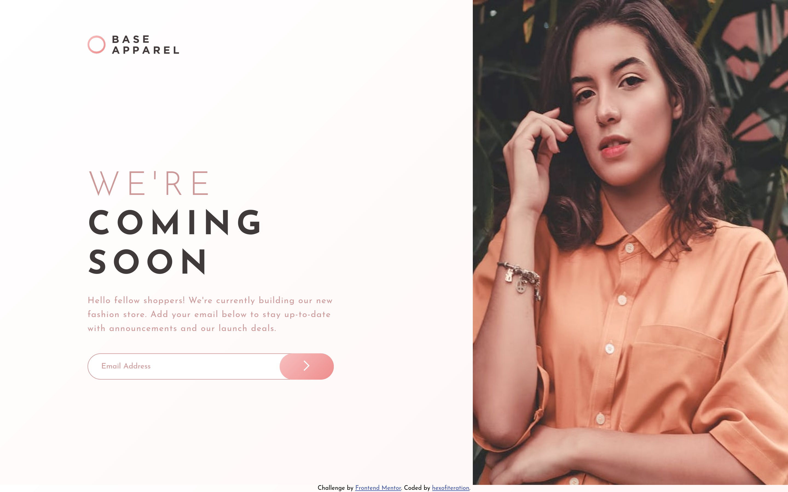

# Frontend Mentor - Base Apparel coming soon page solution

This is a solution to the [Base Apparel coming soon page challenge on Frontend Mentor](https://www.frontendmentor.io/challenges/base-apparel-coming-soon-page-5d46b47f8db8a7063f9331a0). Frontend Mentor challenges help you improve your coding skills by building realistic projects.

## Table of contents

- [Overview](#overview)
  - [The challenge](#the-challenge)
  - [Screenshot](#screenshot)
  - [Links](#links)
- [My process](#my-process)
  - [Built with](#built-with)
  - [What I learned](#what-i-learned)
  - [Continued development](#continued-development)
  - [Useful resources](#useful-resources)
  - [AI Collaboration](#ai-collaboration)
- [Author](#author)
- [Acknowledgments](#acknowledgments)

## Overview

### The challenge

Users should be able to:

- View the optimal layout for the site depending on their device's screen size
- See hover states for all interactive elements on the page
- Receive an error message when the `form` is submitted if:
  - The `input` field is empty
  - The email address is not formatted correctly

### Screenshot



### Links

- Solution URL: [Add solution URL here](https://your-solution-url.com)
- Live Site URL: [Add live site URL here](https://your-live-site-url.com)

## My process

### Built with

- Semantic HTML5 markup
- CSS custom properties
- Flexbox
- CSS Grid
- Mobile-first workflow
- Vanilla JavaScript

### What I learned

- letter-spacing

```css
.heading {
  letter-spacing: 10px;
}
.description {
  letter-spacing: 1px;
}
```

- CSS positioning

```css
form,
.form-group {
  position: relative;
}

.error-icon,
button {
  position: absolute;
}

button {
  top: 0;
  right: 0;
}
```

- input
  - :focus
  - :valid and :invalid
  - ::placeholder

```css
input:focus {
  outline: none;
}
input:focus:valid {
  border-color: hsl(120, 30%, 48%);
}
input:focus:invalid {
  border-color: var(--red-500);
}

input::placeholder {
  color: var(--pink-400);
}
```

- Form validation:
  - required
  - novalidate

```html
<form novalidate>
  <!-- ... -->
</form>

<input
  type="email"
  name="email"
  id="email"
  placeholder="Email Address"
  required
/>
```

- javascript validation

```js
function isEmailValid() {
  if (email.value === "" || !emailRegex.test(email.value)) {
    // ...
  } else {
    // ...
  }
}
```

### Useful resources

- [MDN - `<input type="email">`](https://developer.mozilla.org/en-US/docs/Web/HTML/Reference/Elements/input/email) - Reference for how the email input type works.
- [MDN - Form validation](https://developer.mozilla.org/en-US/docs/Learn_web_development/Extensions/Forms/Form_validation) - walkthrough of client-side validation, including `required`, `novalidate`, and pseudo-classes.
- [SitePoint - HTML Forms & Constraint Validation: The Complete Guide](https://www.sitepoint.com/html-forms-constraint-validation-complete-guide/) - Went deeper into the Constraint Validation API and how `:valid`/`:invalid` and `:focus` interact, which helped with styling the input's border color based on state.
- [The Odin Project - Positioning](https://www.theodinproject.com/lessons/node-path-intermediate-html-and-css-positioning) - Helped me understand the difference between `relative`, `absolute`, and `fixed` positioning, which is what let me place the submit button and error icon inside the input and pin the footer to the bottom of the page.

## Author

- Frontend Mentor - [@hexofiteration](https://www.frontendmentor.io/profile/hexofiteration)
